<!DOCTYPE html>
<HTML>
<HEAD>
	<META charset="UTF-8">
</HEAD>
<BODY>

<H2 id="contents">Study05 README Contents</H2>
<OL>
	<LI><A href="#reactive">Research Reactive RESTful Web Services</A></LI>
	<LI><A href="#hypermedia">Research Hypermedia-based RESTful Web Services</A></LI>
	<LI><A href="#web">Research Web Application</A></LI>
</OL>

<H2 id="reactive">❶ Research Reactive RESTful Web Services</H2>

Java source code: 
 
 package 
	<a href="https://github.com/ee-eng-cs/Study05/tree/master/reactive-rest/src/main/java/kp/company/">kp.company</a> 
 package
	<a href="https://github.com/ee-eng-cs/Study05/tree/master/reactive-rest/src/main/java/kp/client/">kp.client</a> 

The example uses Spring Boot and Spring WebFlux reactive web framework. 
By default it is deployed on an embedded Reactor Netty server.

<TABLE STYLE="border: 1px solid black;">
<CAPTION>Comparing the stacks</CAPTION>
<TR>
	<TH STYLE="border: 1px solid black;">Framework</TH>
	<TH STYLE="border: 1px solid black;">Used Stack</TH>
</TR><TR>
	<TD STYLE="border: 1px solid black;">Spring WebFlux</TD>
	<TD STYLE="border: 1px solid black;">Reactive Stack</TD>
</TR><TR>
	<TD STYLE="border: 1px solid black;">Spring MVC</TD>
	<TD STYLE="border: 1px solid black;">Servlet  Stack</TD>
</TR>
</TABLE>

Actions: 
 
 1. With batch file <I>"01 MVN run.bat"</I> start the server. 
After starting the server it executes single request from the non-blocking web client. 
 2. With batch file <I>"02 call server with curl.bat"</I> execute the request to the server. 

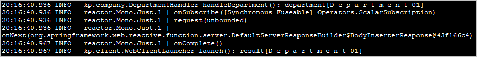 
<I>First action result: console log from reactive server and from non-blocking, reactive client call.</I>

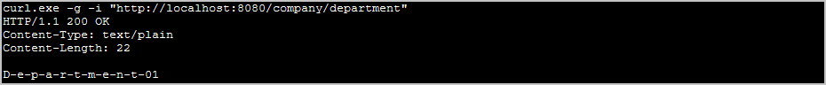 
<I>Second action result: console log from curl.</I>

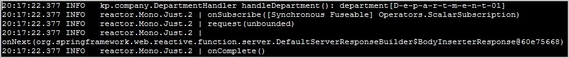 
<I>Second action result: console log from reactive server.</I>

<H3>Application Tests</H3>
<UL>
  <LI>Test with non-blocking, reactive client <B>WebTestClient</B>.</LI>
</UL>

<H2 id="hypermedia">❷ Research Hypermedia-based RESTful Web Services</H2>

Java source code: 
 
 package 
	<a href="https://github.com/ee-eng-cs/Study05/tree/master/rest-hateoas/src/main/java/kp/company/">kp.company</a> 

The example uses Spring Boot, Spring HATEOAS, Spring MVC, embedded H2 database, and Spring Boot Actuator. 
It is deployed on an embedded Apache Tomcat 9 server.

Actions: 
 
 1. With batch file <I>"01 MVN run.bat"</I> start the server. 
 2. With batch file <I>"02 CURL read all.bat"</I> get JSON response with all departments and all employees. 
 3. With batch file <I>"03 CURL CRUD.bat"</I> create, read, update, and delete departments and employees. 
 4. With batch file <I>"04 CURL show profile.bat"</I> show profiles for departments and employees. 
 5. Open in web browser the file <I>"links.html"</I>. 
On that page there are links for showing departments and employees, its profiles and actuator endpoints. 

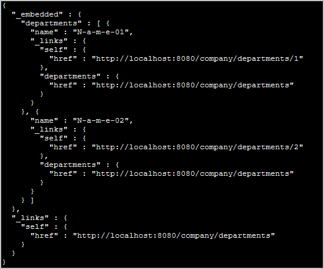 
<I>JSON response for GET all departments request.</I>

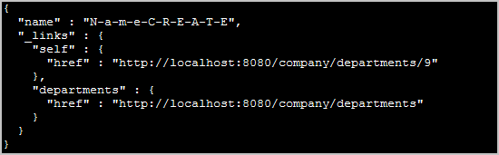 
<I>JSON response for CREATE department request.</I>

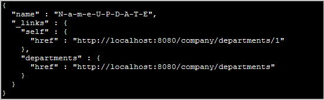 
<I>JSON response for UPDATE department request.</I>

<H3>Application Tests</H3>
<OL>
  <LI>The client side tests. They use <B>TestRestTemplate</B> and the server is started.</LI>
  <LI>Tests with server-side support. They use <B>MockMvc</B> and the server is not started.</LI>
  <LI>The JPA repository tests with an embedded in-memory database.</LI>
</OL>

<H2 id="web">❸ Research Web Application</H2>

Java source code: 
 
 package 
	<a href="https://github.com/ee-eng-cs/Study05/tree/master/web/src/main/java/kp/company/">kp.company</a> 

The example uses Spring Boot, Spring MVC, and Thymeleaf view template library.

Actions: 
 
 1. With batch file <I>"01 MVN run.bat"</I> start the server. 
 2. Go to a page <A href="http://localhost:8080/">http://localhost:8080/</A> and execute CRUD actions. 
 3. With batch file <I>"02 call server with lynx.bat"</I> send requests to the web application from Lynx browser. 

<H3>Use Cases</H3>
<TABLE>
  <TR><TD><B>Company</B></TD><TD>welcome page</TD></TR>
  <TR><TD><B>Show departments</B></TD><TD>table view of company's departments and links to its employees</TD></TR>
  <TR><TD><B>Show employees</B></TD><TD>table view of selected department's employees</TD></TR>
  <TR><TD><B>Edit the existing employee</B></TD><TD>edit the information pertaining to an employee</TD></TR>
  <TR><TD><B>Update the existing employee</B></TD><TD>update the information pertaining to an employee</TD></TR>
  <TR><TD><B>Delete the employee</B></TD><TD>delete employee from the department</TD></TR>
  <TR><TD><B>Add a new employee</B></TD><TD>add a new employee to the department</TD></TR>
  <TR><TD><B>Edit the existing department</B></TD><TD>edit the information pertaining to a department</TD></TR>
  <TR><TD><B>Update the existing department</B></TD><TD>update the information pertaining to a department</TD></TR>
  <TR><TD><B>Delete the department</B></TD><TD>delete existing department (with its employees) from the company</TD></TR>
  <TR><TD><B>Add a new department</B></TD><TD>add a new department to the company</TD></TR>
</TABLE>

<H3>Use Case Diagram</H3>
 

<H3>Application Screens</H3>

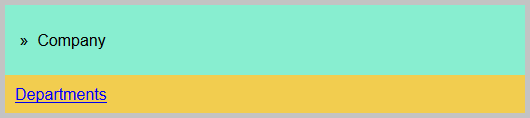 
<I>Welcome page of the application. Overview of the company.</I>

 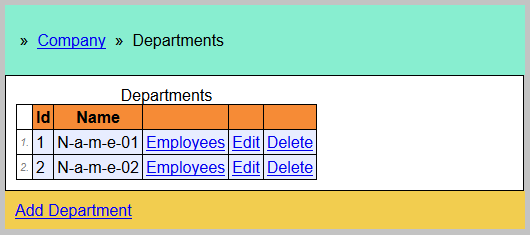 
<I>Listing all departments.</I>

 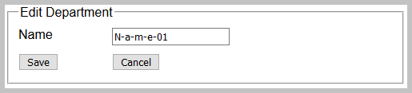 
<I>Editing the existing department.</I>

 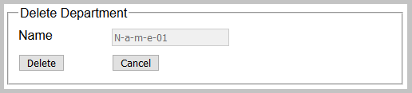 
<I>Deleting the existing department.</I>

 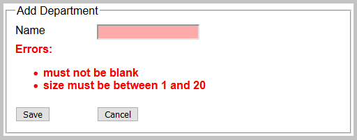 
<I>Adding a new department. Displayed validation messages.</I>

 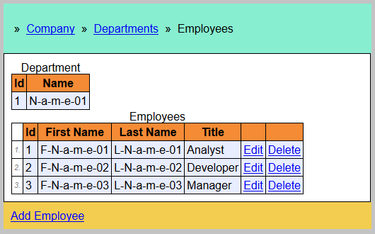 
<I>Listing all employees of the selected department.</I>

 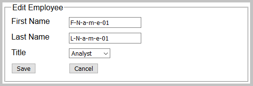 
<I>Editing the existing employee.</I>

 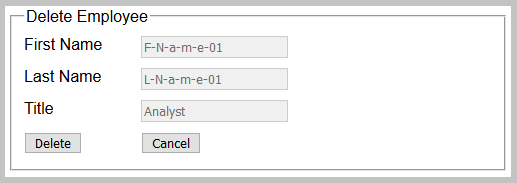 
<I>Deleting the existing employee.</I>

 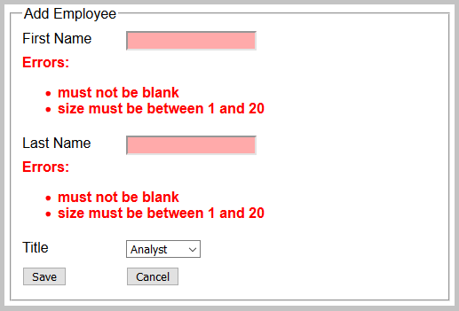 
<I>Adding a new employee. Displayed validation messages.</I>

<H3>Application Tests</H3>
<OL>
  <LI>The client side tests. They use <B>TestRestTemplate</B> and the server is started.</LI>
  <LI>Tests with server-side support. They use <B>MockMvc</B> and the server is not started.</LI>
</OL>

<A href="../reactive-rest/docs/apidocs/index.html?overview-summary.html" >API Specifications</A> for Reactive RESTful Web Services. 
<A href="../rest-hateoas/docs/apidocs/index.html?overview-summary.html" >API Specifications</A> for Hypermedia-based RESTful Web Services. 
<A href="../web/docs/apidocs/index.html?overview-summary.html" >API Specifications</A> for Web Application. 
(API was not commited to <B>GitHub</B>; those links should be active after local build with <I>'mvn javadoc'</I>)

</BODY>
</HTML>